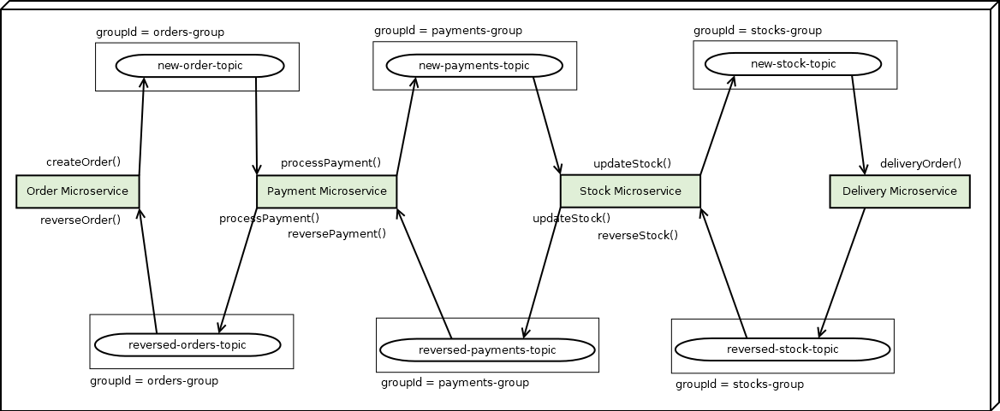

# [Microservices Architecture Patterns - SAGA Design Pattern (Choreography) - Distributed Transaction](https://www.youtube.com/watch?v=WGI_ciUa3FE&t=769s)

## Flujo de microservicios desarrollados

## Transacción en Saga con Coreografía y bróker de mensajería

## Probando transacción distribuida

