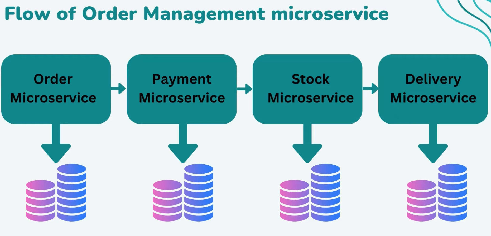

# [Microservices Architecture Patterns - SAGA Design Pattern (Choreography) - Distributed Transaction](https://www.youtube.com/watch?v=WGI_ciUa3FE&t=769s)

## Flujo de microservicios desarrollados



## Transacción en Saga con Coreografía y bróker de mensajería


## Probando transacción distribuida con el patrón SAGA con coreografía

En la raíz de nuestro proyecto tenemos configurado los contenedores de los servicios de bases de datos y Kafka que
usaremos para trabajar con este proyecto, así que lo primero que haremos será levantar todos los servicios del
archivo `compose.yml`:

````bash
$ docker compose up -d
[+] Building 0.0s (0/0)
[+] Running 7/7
✔ Network microservices-saga-pattern_default  Create
✔ Container db-order                          Started
✔ Container db-stock                          Started
✔ Container db-payment                        Started
✔ Container db-delivery                       Started
✔ Container zookeeper                         Started
✔ Container kafka                             Started

$ docker container ls -a
CONTAINER ID   IMAGE                             COMMAND                  CREATED          STATUS          PORTS                                         NAMES
3369116f1877   confluentinc/cp-kafka:7.4.0       "/etc/confluent/dock…"   19 seconds ago   Up 17 seconds   0.0.0.0:9092->9092/tcp                        kafka
a553705479f2   mysql:8.0.33                      "docker-entrypoint.s…"   19 seconds ago   Up 18 seconds   3309/tcp, 33060/tcp, 0.0.0.0:3309->3306/tcp   db-stock
609092ccc8d6   mysql:8.0.33                      "docker-entrypoint.s…"   19 seconds ago   Up 18 seconds   3308/tcp, 33060/tcp, 0.0.0.0:3308->3306/tcp   db-payment
55d08b424f4e   confluentinc/cp-zookeeper:7.4.0   "/etc/confluent/dock…"   19 seconds ago   Up 17 seconds   2181/tcp, 2888/tcp, 3888/tcp                  zookeeper
dd1121b3bfb1   mysql:8.0.33                      "docker-entrypoint.s…"   19 seconds ago   Up 17 seconds   3310/tcp, 33060/tcp, 0.0.0.0:3310->3306/tcp   db-delivery
af1ca2c9cb57   mysql:8.0.33                      "docker-entrypoint.s…"   19 seconds ago   Up 17 seconds   3307/tcp, 33060/tcp, 0.0.0.0:3307->3306/tcp   db-order
````

Ahora, procedemos a levantar los cuatro microservicios de nuestro proyecto. Si es la primera vez que lo hacemos,
observaremos en consola la creación de las tablas en sus respectivas bases de datos.

Para empezar a realizar las pruebas de las transacciónes entre microservicios, necesitamos agregar algunos registros
en nuestro microservicio `stock microservice`:

````bash
$ curl -v -X POST -H "Content-Type: application/json" -d "{\"item\": \"books\", \"quantity\": 20 }" http://localhost:8083/api/v1/stocks | jq

>
< HTTP/1.1 201
````

### Transacción exitosa

Realizamos una transacción exitosa enviando una petición al endpoint del microservicio `order` que es desde donde se
inicia la transacción:

````bash
$ curl -v -X POST -H "Content-Type: application/json" -d "{\"item\": \"books\", \"quantity\": 5, \"amount\": 320, \"address\": \"Trujillo\", \"paymentMethod\": \"Credit Card\"}" http://localhost:8081/api/v1/orders | jq

>
< HTTP/1.1 201
````

Como observamos, estamos enviando una cantidad de 5, eso significa que el proceso debe ejecutarse correctamente, ya que
en stock registramos 20 cantidades de books:

`Log: order-service`

````bash
2024-01-02T13:23:57.389-05:00 DEBUG 12100 --- [order-service] [nio-8081-exec-2] org.hibernate.SQL                        : 
    insert 
    into
        orders
        (amount, item, quantity, status) 
    values
        (?, ?, ?, ?)
````

`Log: payment-service`

````bash
2024-01-02T13:23:57.681-05:00  INFO 14900 --- [payment-service] [ntainer#0-0-C-1] d.m.p.listeners.PaymentEventListener     : Received event for payment: {"order":{"item":"books","quantity":5,"amount":320.0,"paymentMethod":"Credit Card","orderId":1,"address":"Trujillo"},"type":"ORDER_CREATED"}
2024-01-02T13:23:57.846-05:00 DEBUG 14900 --- [payment-service] [ntainer#0-0-C-1] org.hibernate.SQL                        : 
    insert 
    into
        payments
        (amount, mode, order_id, status) 
    values
        (?, ?, ?, ?)
````

`Log: stock-service`

````bash
2024-01-02T13:23:58.021-05:00  INFO 304 --- [stock-service] [ntainer#1-0-C-1] d.m.s.listeners.StockEventListener       : Update stock for order: {"order":{"item":"books","quantity":5,"amount":320.0,"paymentMethod":"Credit Card","orderId":1,"address":"Trujillo"},"type":"PAYMENT_CREATED"}
2024-01-02T13:23:58.057-05:00 DEBUG 304 --- [stock-service] [ntainer#1-0-C-1] org.hibernate.SQL                        : 
    select
        w1_0.id,
        w1_0.item,
        w1_0.quantity 
    from
        stocks w1_0 
    where
        w1_0.item=?
2024-01-02T13:23:58.074-05:00 DEBUG 304 --- [stock-service] [ntainer#1-0-C-1] org.hibernate.SQL                        : 
    select
        w1_0.id,
        w1_0.item,
        w1_0.quantity 
    from
        stocks w1_0 
    where
        w1_0.id=?
2024-01-02T13:23:58.083-05:00 DEBUG 304 --- [stock-service] [ntainer#1-0-C-1] org.hibernate.SQL                        : 
    update
        stocks 
    set
        item=?,
        quantity=? 
    where
        id=?
````

`Log: delivery-service`

````bash
2024-01-02T13:23:58.212-05:00  INFO 8428 --- [delivery-service] [ntainer#0-0-C-1] d.m.d.listeners.DeliveryEventListener    : Ship order for order: {"order":{"item":"books","quantity":5,"amount":320.0,"paymentMethod":"Credit Card","orderId":1,"address":"Trujillo"},"type":"STOCK_UPDATED"}
2024-01-02T13:23:58.310-05:00 DEBUG 8428 --- [delivery-service] [ntainer#0-0-C-1] org.hibernate.SQL                        : 
    insert 
    into
        deliveries
        (address, order_id, status) 
    values
        (?, ?, ?)
````

**NOTA**

> Según el libro de `Microservicios un enfoque integrado`, el primer microservicio `order-service` debería registrar el
> order en su base de datos con el estado `IN_PROCESS` y el último microservicio, en este caso el `delivery-service`
> debe lanzar el evento `pedido-confirmado` para que el microservicio `order-service` lo escuche y actualice el estado
> del registro creado inicialmente, es decir pasar del estado `IN_PROCESS` a `COMMIT`.
>
> En este proyecto no se está realizando de esa manera, pues se trata de un ejemplo para conocer a grandes rasgos el
> funcionamiento de las transacciones distribuidas utilizando el patrón SAGA con coreografía.

### Transacción fallida

Realizamos una transacción fallida enviando una petición al endpoint del microservicio `order` con una `quantity: 50`,
lo que significa que, como en el stock actualmente tenemos una cantidad de 15 unidades para el registro `books`, la
transacción fallará, pues la cantidad solicitada (50) es mayor a la cantidad disponible (15):

````bash
$ curl -v -X POST -H "Content-Type: application/json" -d "{\"item\": \"books\", \"quantity\": 50, \"amount\": 900, \"address\": \"Chimbote\", \"paymentMethod\": \"Credit Card\"}" http://localhost:8081/api/v1/orders | jq

>
< HTTP/1.1 201
````

Como observamos, estamos enviando una cantidad de 50, eso significa que el proceso debe fallar en el último
microservicio, enviando un evento para que los microservicios anteriores a él, empiecen a revertir los cambios
realizados:

`Log: order-service`

````bash
2024-01-02T13:35:46.662-05:00 DEBUG 12100 --- [order-service] [nio-8081-exec-3] org.hibernate.SQL                        : 
    insert 
    into
        orders
        (amount, item, quantity, status) 
    values
        (?, ?, ?, ?)

2024-01-02T13:35:47.036-05:00  INFO 12100 --- [order-service] [ntainer#0-0-C-1] d.m.o.l.ReverseOrderEventListener        : Reverse order event: {"order":{"item":"books","quantity":50,"amount":900.0,"paymentMethod":"Credit Card","orderId":2,"address":"Chimbote"},"type":"ORDER_REVERSED"}
2024-01-02T13:35:47.092-05:00 DEBUG 12100 --- [order-service] [ntainer#0-0-C-1] org.hibernate.SQL                        : 
    select
        o1_0.id,
        o1_0.amount,
        o1_0.item,
        o1_0.quantity,
        o1_0.status 
    from
        orders o1_0 
    where
        o1_0.id=?
2024-01-02T13:35:47.111-05:00 DEBUG 12100 --- [order-service] [ntainer#0-0-C-1] org.hibernate.SQL                        : 
    select
        o1_0.id,
        o1_0.amount,
        o1_0.item,
        o1_0.quantity,
        o1_0.status 
    from
        orders o1_0 
    where
        o1_0.id=?
2024-01-02T13:35:47.122-05:00 DEBUG 12100 --- [order-service] [ntainer#0-0-C-1] org.hibernate.SQL                        : 
    update
        orders 
    set
        amount=?,
        item=?,
        quantity=?,
        status=? 
    where
        id=?
````

`Log: payment-service`

````bash
2024-01-02T13:35:46.696-05:00  INFO 14900 --- [payment-service] [ntainer#0-0-C-1] d.m.p.listeners.PaymentEventListener     : Received event for payment: {"order":{"item":"books","quantity":50,"amount":900.0,"paymentMethod":"Credit Card","orderId":2,"address":"Chimbote"},"type":"ORDER_CREATED"}
2024-01-02T13:35:46.699-05:00 DEBUG 14900 --- [payment-service] [ntainer#0-0-C-1] org.hibernate.SQL                        : 
    insert 
    into
        payments
        (amount, mode, order_id, status) 
    values
        (?, ?, ?, ?)
2024-01-02T13:35:46.762-05:00  INFO 14900 --- [payment-service] [ntainer#1-0-C-1] d.m.p.l.ReversePaymentEventListener      : Reverse payment for order: {"order":{"item":"books","quantity":50,"amount":900.0,"paymentMethod":"Credit Card","orderId":2,"address":"Chimbote"},"type":"PAYMENT_REVERSED"}
2024-01-02T13:35:46.930-05:00 DEBUG 14900 --- [payment-service] [ntainer#1-0-C-1] org.hibernate.SQL                        : 
    select
        p1_0.id,
        p1_0.amount,
        p1_0.mode,
        p1_0.order_id,
        p1_0.status 
    from
        payments p1_0 
    where
        p1_0.order_id=?
2024-01-02T13:35:46.947-05:00 DEBUG 14900 --- [payment-service] [ntainer#1-0-C-1] org.hibernate.SQL                        : 
    select
        p1_0.id,
        p1_0.amount,
        p1_0.mode,
        p1_0.order_id,
        p1_0.status 
    from
        payments p1_0 
    where
        p1_0.id=?
2024-01-02T13:35:46.958-05:00 DEBUG 14900 --- [payment-service] [ntainer#1-0-C-1] org.hibernate.SQL                        : 
    update
        payments 
    set
        amount=?,
        mode=?,
        order_id=?,
        status=? 
    where
        id=?

````

`Log: stock-service`

````bash
2024-01-02T13:35:46.738-05:00  INFO 304 --- [stock-service] [ntainer#1-0-C-1] d.m.s.listeners.StockEventListener       : Update stock for order: {"order":{"item":"books","quantity":50,"amount":900.0,"paymentMethod":"Credit Card","orderId":2,"address":"Chimbote"},"type":"PAYMENT_CREATED"}
2024-01-02T13:35:46.741-05:00 DEBUG 304 --- [stock-service] [ntainer#1-0-C-1] org.hibernate.SQL                        : 
    select
        w1_0.id,
        w1_0.item,
        w1_0.quantity 
    from
        stocks w1_0 
    where
        w1_0.item=?
````